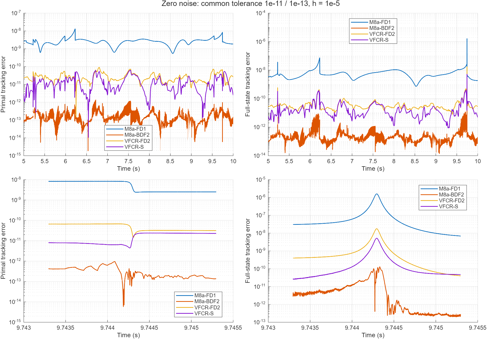
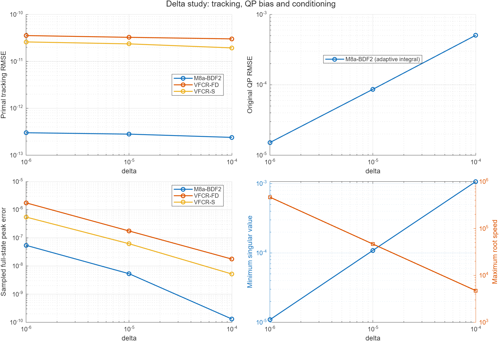
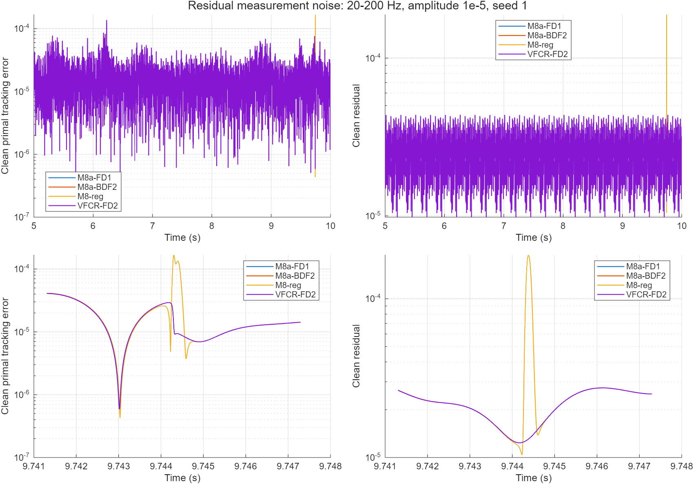
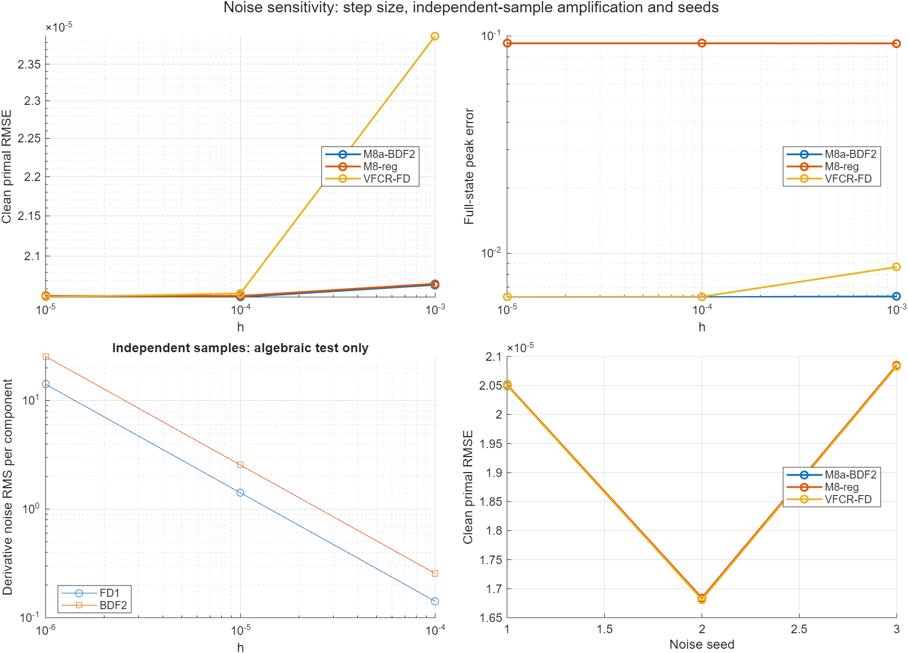

# M8a-BDF2、delta study 与 noise study

本轮完成 **37 组主实验、8 组复核、2 组 delta 与噪声联合检查，共 47 组完整 ODE 实验**。另有公式审计、参考解检查、差分预测诊断和独立样本噪声放大测试。日期 2026-10-07。

**核心结论：二阶后向差分成功降低无噪声跟踪误差；减小 delta 改善原题精度，却使乘子尖峰更敏感；测量噪声出现后，高精度优势基本被噪声淹没，固定预测阻尼并没有成为可靠的抗噪改进。**

依据[最新聊天建议](https://chatgpt.com/g/g-p-6ab9211b1de081919276a3f4e721199e-gnngai-jin/shared/c/6a9e7bd7-8730-83ec-9027-9b4f35cd5f38)，沿用 Example 2。公式和噪声位置见[系统说明](系统说明.md)，复现方法见[README](README.md)。

## 1. 无噪声：BDF2 有效，但不能只比较最后几位数字

下表统计 5–10 s，容差均为 1e-11/1e-13、delta=1e-4。xd 是相对扰动根的 x RMSE，gpeak 是完整状态最大误差；VFCR-S 使用解析导数，其 h 不参与计算。

| model | order | h | xd | gpeak | respeak | calls |
| --- | --- | --- | --- | --- | --- | --- |
| M8a-FD1 | 1 | 1e-05 | 2.96605e-09 | 1.60101e-06 | 9.13427e-09 | 38245 |
| M8a-BDF2 | 2 | 0.0001 | 1.71272e-11 | 1.10718e-08 | 2.87365e-11 | 38506 |
| M8a-BDF2 | 2 | 1e-05 | 2.39679e-13 | 1.30654e-10 | 1.6592e-12 | 37795 |
| M8a-BDF2 | 2 | 1e-06 | 4.44103e-13 | 3.83695e-10 | 1.91415e-12 | 39429 |
| VFCR-FD | 1 | 1e-05 | 5.69588e-07 | 6.36471e-05 | 2.31305e-06 | 41758 |
| VFCR-FD | 2 | 1e-05 | 3.01573e-11 | 1.75962e-08 | 9.57348e-11 | 41377 |
| VFCR-S | 2 | 1e-05 | 1.93668e-11 | 5.1832e-09 | 8.5946e-11 | 41727 |

同样 h=1e-5，M8a-BDF2 的 x 跟踪 RMSE 比一阶 M8a 改善约 **12375 倍**。BDF2 的 h 从 1e-4 改成 1e-5 时改善约 71.5 倍；再改成 1e-6 则没有改善，已受到浮点相消、积分误差和参考误差影响。不能继续套用“h 越小越好”。

预测项的独立审计中，步长减半时误差比的中位数约 4，符合二阶截断误差。第二个切换时刻，BDF2 的预测速度误差从 h=1e-4 的约 2.21e-4 降至 h=1e-5 的约 2.01e-6；h=1e-6 反而约 7.66e-6。完整记录见[prediction.csv](prediction.csv)。

### 更严格容差复核

将两种 FD2 模型和解析 VFCR-S 的容差再收紧到 1e-12/1e-14：

| model | rtol | atol | xd | gpeak | respeak | calls |
| --- | --- | --- | --- | --- | --- | --- |
| M8a-BDF2 | 1e-12 | 1e-14 | 1.51122e-13 | 2.86563e-10 | 6.28437e-13 | 71674 |
| VFCR-FD | 1e-12 | 1e-14 | 2.44934e-11 | 1.30451e-08 | 6.33409e-11 | 77825 |
| VFCR-S | 1e-12 | 1e-14 | 2.87045e-12 | 1.58988e-09 | 1.25783e-11 | 75983 |

本配置下 M8a-BDF2 的计算结果仍小于两个 VFCR 对照，但它的误差已经接近数值底部，尖峰还随容差发生变化。这里不能宣布它超过 VFCR 的数学精度极限。GNN 与 VFCR 的纠错增益、速度预算不同；本轮实现的是“同信息、同初值、同题目”的比较，而非相同物理预算的全面公平比较。

上一轮 M8a 与 VFCR-S 的主要差距来自一阶差分。本轮不再只有“减小一阶 h”这个办法，BDF2 已消除了大部分差分偏差。这是本轮最确定的改进。

## 2. Delta study：原题精度提高，完整状态变得更难跟踪

保持 BDF2 的 h=1e-5，分别改变 delta。x 是相对原始 QP 最优解的 RMSE，bias 是扰动根与原题解之间的 RMSE。

| model | delta | xd | x | bias | gpeak |
| --- | --- | --- | --- | --- | --- |
| M8a-BDF2 | 0.0001 | 2.39679e-13 | 0.000506438 | 0.000506438 | 1.30654e-10 |
| VFCR-FD | 0.0001 | 3.01573e-11 | 0.000506438 | 0.000506438 | 1.75962e-08 |
| VFCR-S | 0.0001 | 1.93668e-11 | 0.000506438 | 0.000506438 | 5.1832e-09 |
| M8a-BDF2 | 1e-05 | 2.8136e-13 | 8.59621e-05 | 8.59621e-05 | 5.33301e-09 |
| VFCR-FD | 1e-05 | 3.25406e-11 | 8.59621e-05 | 8.59621e-05 | 1.7576e-07 |
| VFCR-S | 1e-05 | 2.36026e-11 | 8.59621e-05 | 8.59621e-05 | 6.19459e-08 |
| M8a-BDF2 | 1e-06 | 3.01142e-13 | 1.49275e-05 | 1.49275e-05 | 5.42807e-08 |
| VFCR-FD | 1e-06 | 3.54802e-11 | 1.49275e-05 | 1.49275e-05 | 1.75395e-06 |
| VFCR-S | 1e-06 | 2.59645e-11 | 1.49275e-05 | 1.49275e-05 | 5.47763e-07 |

上表是原始固定网格统计。原题误差在其他窄切换处仍会受网格影响，因此又用自适应积分专门复核，最终应使用下面的原题 RMSE：

| delta | bias | x | biasbound | xbound |
| --- | --- | --- | --- | --- |
| 0.0001 | 0.000506831 | 0.000506831 | 3.76709e-15 | 3.76606e-15 |
| 1e-05 | 8.63487e-05 | 8.63487e-05 | 1.09137e-16 | 1.08976e-16 |
| 1e-06 | 1.51312e-05 | 1.51312e-05 | 3.98903e-18 | 3.98047e-18 |

biasbound/xbound 是平方误差时间积分的估计误差，不是 RMSE 本身的误差界。

自适应积分容差从 1e-6 收紧到 1e-8，并改变初始分段，x RMSE 最大相对变化 4.47e-06%。M8a-BDF2 的原题 RMSE 从 0.000506831 降到 1.51312e-05，改善约 **33.5 倍**；xd 始终很小，说明此时主要限制来自 PFB 扰动，而不是追不上扰动根。三点扫描不足以声称普适的 delta 幂律。

但完整状态误差尖峰增大。参考根的病态程度与速度也明显恶化：

| delta | sigma | speed | residual | polished | gshift | xshift |
| --- | --- | --- | --- | --- | --- | --- |
| 0.0001 | 0.00107224 | 4735.71 | 3.8901e-12 | 6.76374e-16 | 1.02927e-11 | 2.0107e-15 |
| 1e-05 | 0.000108788 | 46633.5 | 3.79718e-11 | 4.97453e-16 | 1.11772e-10 | 2.0107e-15 |
| 1e-06 | 1.0909e-05 | 465000 | 4.41768e-10 | 6.48797e-16 | 1.09837e-09 | 2.10942e-15 |

sigma 是参考轨迹上最小奇异值的最小值；speed 是完整状态最大速度。gshift/xshift 表示用稳定残差进行最多三次 Newton 校正时参考解的变化量，用来判断参考解的浮点误差；不是模型误差。小 delta 下参考乘子的误差更值得检查，不能将 gpeak 的全部变化都简单解释成跟踪误差。

图中的原题 RMSE 使用自适应积分，其余曲线来自保存网格。对检测到的尖峰进一步局部加密至 5e-9 s，并使用校正后的参考根，结果如下：

| run | delta | center | coarse | peak | fine | change |
| --- | --- | --- | --- | --- | --- | --- |
| 3 | 0.0001 | 9.74433 | 1.3069e-10 | 9.74433 | 1.30715e-10 | 0.000188825 |
| 8 | 1e-05 | 9.74429 | 5.34467e-09 | 9.74429 | 5.35227e-09 | 0.00142104 |
| 11 | 1e-06 | 9.74429 | 5.64692e-08 | 9.74429 | 5.74349e-08 | 0.0171018 |
| 12 | 1e-06 | 9.74429 | 1.76661e-06 | 9.74429 | 1.76877e-06 | 0.00121735 |
| 13 | 1e-06 | 9.74429 | 5.51994e-07 | 9.74429 | 5.52904e-07 | 0.00164761 |
| 15 | 0.0001 | 9.74429 | 0.0063027 | 9.74429 | 0.0063027 | 9.26459e-08 |
| 17 | 0.0001 | 9.74429 | 0.0063041 | 9.74429 | 0.0063041 | 9.08398e-08 |

delta=1e-6 的 M8a-BDF2 完整状态峰值应理解为约 6e-8 的量级；最后几位仍受参考根和浮点误差影响。局部加密不改变小 delta 更敏感的结论。

## 3. Noise study：误差由观测噪声主导

本轮注入残差测量噪声 xi_obs=xi+n，频率 20–200 Hz，16 个频率叠加，固定三个高斯系数种子，振幅 A=1e-5。各模型看到同一条噪声，噪声进入纠错、时间差分和 VFCR 积分，评价目标仍为干净根。不是在每次 RHS 上重新抽随机数，也不是原 VFCR 的 RHS 外部扰动噪声。

| model | meanxd | medianxd | minxd | maxxd | mingpeak | maxgpeak | meanresidual |
| --- | --- | --- | --- | --- | --- | --- | --- |
| M8a-FD1 | 1.93838e-05 | 2.05049e-05 | 1.68145e-05 | 2.0832e-05 | 0.00222433 | 0.00630595 | 2.54784e-05 |
| M8a-BDF2 | 1.93808e-05 | 2.05017e-05 | 1.68118e-05 | 2.0829e-05 | 0.00222558 | 0.0063027 | 2.54745e-05 |
| M8-reg | 1.94017e-05 | 2.05147e-05 | 1.68395e-05 | 2.0851e-05 | 0.0924045 | 0.0981371 | 2.54926e-05 |
| VFCR-FD | 1.93813e-05 | 2.05022e-05 | 1.68123e-05 | 2.08295e-05 | 0.00222441 | 0.0063041 | 2.54751e-05 |

一阶、二阶 GNN 和 VFCR-FD2 的平均 x 误差非常接近。无噪声时 BDF2 的极小截断误差，在这个噪声水平下被观测误差淹没。这是三个种子的探索性结果，不是大样本统计显著性结论。

### 固定正则化的代价

M8-reg 仅将预测阻尼设为 1e-6，纠错与 M8a 相同。它的无噪声基线：

| model | xd | gpeak | respeak |
| --- | --- | --- | --- |
| M8-reg | 9.11162e-07 | 0.0959847 | 0.000194711 |

其带噪 x RMSE 没有明显改善，完整状态尖峰却较大。无噪声时就存在较大的预测阻尼误差，说明它的坏结果不能全部归咎于噪声。固定阻尼会一并削弱目标运动和噪声变化，不能自动得到好的抗噪模型。

### 振幅、差分步长与常量噪声

| model | noise | amp | h | xd | gpeak | residual | obs |
| --- | --- | --- | --- | --- | --- | --- | --- |
| M8a-BDF2 | colored | 1e-05 | 1e-05 | 2.05017e-05 | 0.0063027 | 2.67891e-05 | 6.83124e-11 |
| M8-reg | colored | 1e-05 | 1e-05 | 2.05147e-05 | 0.0924045 | 2.68047e-05 | 9.62958e-07 |
| VFCR-FD | colored | 1e-05 | 1e-05 | 2.05022e-05 | 0.0063041 | 2.67898e-05 | 1.16611e-09 |
| M8a-BDF2 | colored | 1e-07 | 1e-05 | 2.05015e-07 | 6.30358e-05 | 2.67888e-07 | 2.90251e-11 |
| M8-reg | colored | 1e-07 | 1e-05 | 9.32364e-07 | 0.0959488 | 9.9878e-07 | 9.62676e-07 |
| VFCR-FD | colored | 1e-07 | 1e-05 | 2.05086e-07 | 6.45681e-05 | 2.67999e-07 | 8.32403e-10 |
| M8a-BDF2 | colored | 1e-05 | 0.0001 | 2.0502e-05 | 0.00630227 | 2.67895e-05 | 4.13107e-09 |
| M8-reg | colored | 1e-05 | 0.0001 | 2.0515e-05 | 0.0924051 | 2.6805e-05 | 9.62978e-07 |
| VFCR-FD | colored | 1e-05 | 0.0001 | 2.05446e-05 | 0.00632697 | 2.68452e-05 | 7.33598e-08 |
| M8a-BDF2 | colored | 1e-05 | 0.001 | 2.06492e-05 | 0.00634224 | 2.69829e-05 | 3.7536e-07 |
| M8-reg | colored | 1e-05 | 0.001 | 2.0662e-05 | 0.092357 | 2.69983e-05 | 1.03284e-06 |
| VFCR-FD | colored | 1e-05 | 0.001 | 2.38922e-05 | 0.00866282 | 3.12132e-05 | 6.71907e-06 |
| M8a-BDF2 | constant | 1e-05 | 1e-05 | 1.74129e-05 | 0.0110399 | 2.64575e-05 | 1.74685e-10 |
| M8-reg | constant | 1e-05 | 1e-05 | 1.74108e-05 | 0.089599 | 2.64714e-05 | 9.62092e-07 |
| VFCR-FD | constant | 1e-05 | 1e-05 | 1.7413e-05 | 0.0110414 | 2.64575e-05 | 5.96719e-09 |

residual 是干净残差 RMS；obs 是带噪观测残差 RMS。观测残差小，不代表原始问题残差小：可能只是跟着带噪根运动。常量噪声的差分为零，但仍使纠错目标偏移，所以“差分不放大常量噪声”不等于“常量噪声没有影响”。

本轮有限带宽噪声在 h 很小时接近自身的时间导数，不呈现独立样本那种无界 1/h 放大；改变 h 的实际 ODE 结果只能解释本轮噪声带宽。另对独立高斯样本做代数测试，得到 BDF2 导数噪声约为一阶的 **1.803 倍**，且两者都随 1/h 增长，记录见[iid.csv](iid.csv)。该测试不等于完成了白噪声 ODE 实验。

## 4. Delta 与噪声联合检查

固定种子 1、A=1e-5、h=1e-5，仅将 delta 从 1e-4 改为 1e-6：

| model | delta | xd | x | gpeak | residual | obs |
| --- | --- | --- | --- | --- | --- | --- |
| M8a-BDF2 | 0.0001 | 2.05017e-05 | 0.000506451 | 0.0063027 | 2.67891e-05 | 6.83124e-11 |
| VFCR-FD | 0.0001 | 2.05022e-05 | 0.000506451 | 0.0063041 | 2.67898e-05 | 1.16611e-09 |
| M8a-BDF2 | 1e-06 | 2.05677e-05 | 2.53087e-05 | 0.378431 | 2.67891e-05 | 6.8458e-11 |
| VFCR-FD | 1e-06 | 2.05682e-05 | 2.53093e-05 | 0.378467 | 2.67898e-05 | 1.18494e-09 |

减小 delta 仍降低原题平均误差，但完整状态尖峰明显放大；M8a-BDF2 的 gpeak 放大约 60.0 倍。此时 x 跟踪误差已经与 delta 的原题偏差相当，小 delta 不再能单独决定最终精度。这里只做同一种子的机制检查，不代表所有噪声分布。

## 5. 验证和可复现性

| bdf | formula | vfcr | ratio | ratiomin | ratiomax |
| --- | --- | --- | --- | --- | --- |
| 4.98262e-11 | 7.19044e-14 | 1.13118e-14 | 4.0004 | 3.99125 | 4.01671 |

公式审计 100 个随机状态；解析 VFCR 的稳定实现与原 my_system.m 等价，最大相对差约 1.13e-14。因果启动和重复调用已检查。所有 value-only 动力学运行时删除六个解析导数字段。

37 组主轨迹均重新读取并独立计算时间加权 RMSE；deval 与保存轨迹差为零。加密输出网格后，扰动根 x 跟踪 RMSE 最大相对变化 0.236%，完整状态峰值最大相对变化 4.01%。详见[verification.csv](verification.csv)，其中 xdp、gpeakp 使用 Newton 校正后的参考根，专门检查原参考误差对排名的影响。

参考根校正后，主配置 M8a-BDF2 的加密网格 x RMSE 为 2.40072e-13、完整状态峰值 1.3069e-10；因此最后几位数字应按数值量级理解。

额外 8 组复核和 2 组联合检查也重新读取并复算，轨迹、误差数组和抽查的干净残差一致，见[other_check.csv](other_check.csv)。源码与共用依赖的校验值见[sources.csv](sources.csv)。

噪声组另收紧容差、减半最大积分步长，仍然完成：

| model | rtol | atol | h | xd | gpeak | calls |
| --- | --- | --- | --- | --- | --- | --- |
| M8a-BDF2 | 1e-09 | 1e-11 | 1e-05 | 2.05017e-05 | 0.00630269 | 101887 |
| VFCR-FD | 1e-09 | 1e-11 | 1e-05 | 2.05021e-05 | 0.00630309 | 102400 |
| M8a-BDF2 | 1e-08 | 1e-10 | 1e-05 | 2.05017e-05 | 0.0063027 | 70076 |
| VFCR-FD | 1e-08 | 1e-10 | 1e-05 | 2.05022e-05 | 0.0063041 | 71751 |

该表前两组收紧容差，后两组把最大积分步长减为 0.00025 s。四幅图均重新打开 FIG 核对曲线数据，并逐幅目视检查。

运行秒数受同时进行的 MATLAB 检查和每次求值成本影响，不能用来宣布普适速度优势。每组原始配置、轨迹、误差和预算结果都保留。调试时的空采样保存错误保存在 data；修复后完整主数据在 results。

## 6. 下一步建议

1. **无噪声主模型采用 M8a-BDF2，先用 h=1e-5。** 这一步已有明确实验支持；本题继续缩小 h 没有收益。
2. **无噪声高原题精度用 delta=1e-6，带噪时一起检查乘子尖峰。** 本轮噪声下先以 delta=1e-4 作为稳定研究基线，而不是只看 x 的平均误差。
3. **抗噪下一步先试时间滤波或固定采样的导数估计。** 从带噪历史残差中估计时间偏导，并单独比较滤波误差、延迟与尖峰。不要同时改变太多参数。该改进本轮尚未实现。
4. **保留 VFCR-FD2 作为 value-only 对照。** 如果要比较硬件控制能力，应另外匹配实际物理速度预算；如果要研究采样噪声，应固定采样率和历史插值，再做多种子闭环实验。
5. **暂不加入固定时间激活或 M7 缩放。** 先处理观测噪声和小 delta 的病态放大，当前数据没有证明一般鲁棒性或固定时间收敛。

[完整主指标](results/metrics.csv) · [高精度与噪声复核](extra/metrics.csv) · [联合检查](joint/metrics.csv) · [系统说明](系统说明.md)
