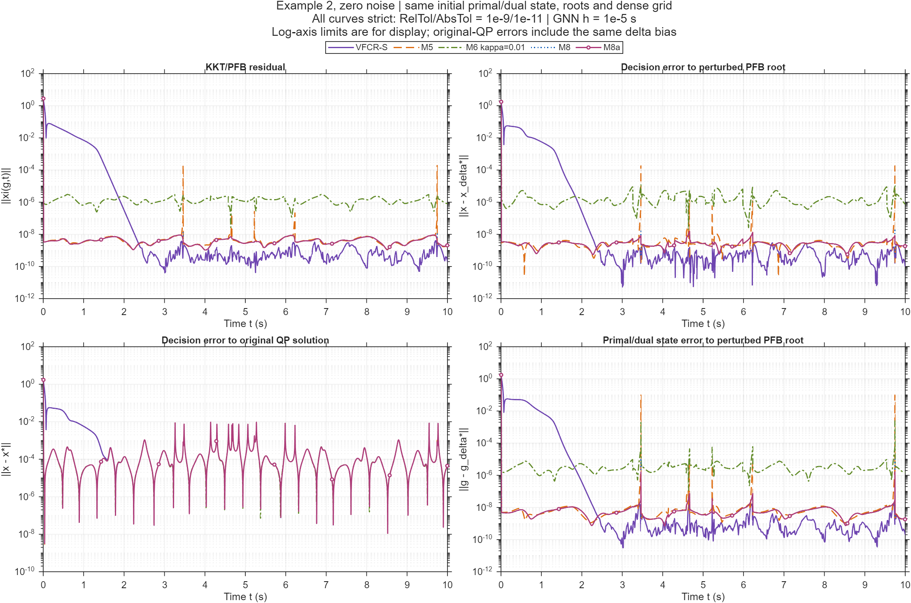
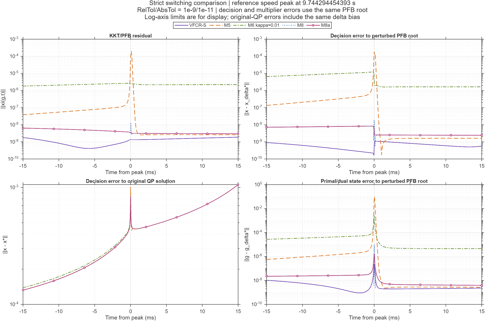
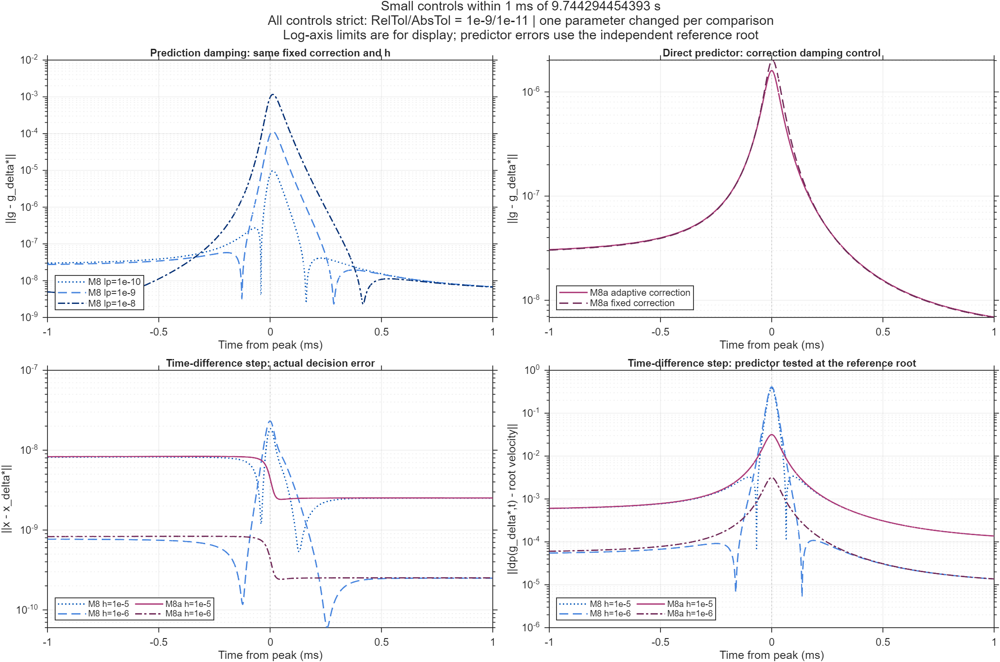
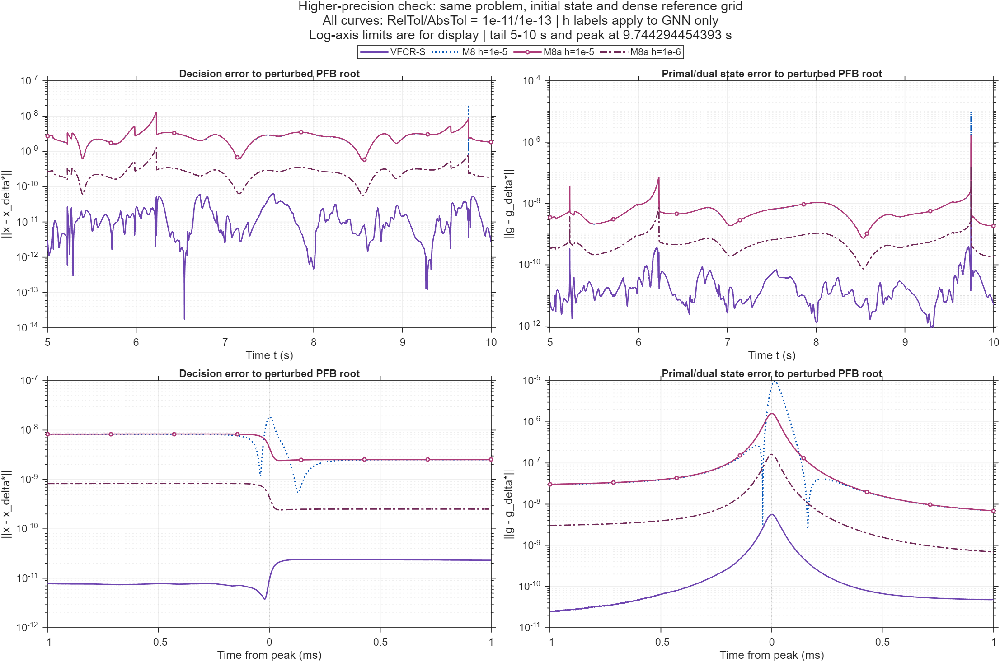

# M8 / M8a 与旧 GNN、VFCR 的比较

**M8 和 M8a 都明显改善了旧模型；当前更值得继续的是 M8a。它基本去除了预测阻尼造成的速度损失，但高精度复核后，VFCR-S 的无噪声稳态跟踪仍更准。**

本轮实际新增 13 次完整积分：9 次主实验与小对照，另加 4 次更严格的数值复核。没有扩展噪声、fixed-time、M7 新设置或大规模参数扫描。旧模型使用上轮保存的完整轨迹，本轮重新核对了源码、设置和指标。

## 1. 实现了什么

M8 把两个阻尼分开：纠错用 $\lambda_c=10^{-6}$，预测用 $\lambda_p=10^{-10}$。这样纠错仍有正则化，而预测只损失很少的根速度。

M8a 直接解 $Jd_p=-\widehat{\xi_t}$，纠错沿用 M6 的 $\lambda_c=\max(10^{-10},0.01\sigma_{\min}^2(J))$。两者都用固定当前状态的时间差分，系统不读取解析系数导数。

聊天先把分离阻尼统称为 M8，最后列表又将具体固定阻尼例子称作 M8b；本目录按照用户的称呼统一使用 M8。完整公式、初始化差分边界和接口见 [系统说明](系统说明.md)。

## 2. 相同严格容差的主比较

Example 2、零噪声、相同初值、$\delta=10^{-4}$。GNN 使用 $\gamma=200$、$\varepsilon=0.01$；带预测的 GNN 差分步长均为 $h=10^{-5}$。VFCR-S 保留上轮参数 $r_1=r_2=a=\lambda_1=\lambda_2=1$、$p=q=0.5$、平滑宽度 0.01，积分状态初值为零。以下全部使用 RelTol/AbsTol=$10^{-9}/10^{-11}$，误差统计区间为 $[5,10]$ 秒。

| 模型 | $x$ 对扰动根 RMSE | 完整状态 $g$ RMSE | 完整状态最大误差 | 最大残差 | RHS 次数（0–10 s） |
|---|---:|---:|---:|---:|---:|
| M3 | 4.547e-4 | 7.469e-3 | 4.838e-1 | 1.869e-2 | 15285 |
| M5 | 9.230e-7 | 3.642e-4 | 9.683e-2 | 1.964e-4 | 15860 |
| M6，$\kappa=0.05$ | 1.204e-5 | 5.650e-5 | 1.439e-2 | 1.679e-5 | 19100 |
| M6，$\kappa=0.01$ | 2.407e-6 | 9.972e-6 | 2.405e-3 | 3.043e-6 | 16727 |
| M7（旧设置） | 1.657e-5 | 4.997e-5 | 1.193e-2 | 1.755e-5 | 18811 |
| **M8** | **2.946e-9** | **2.846e-8** | **9.798e-6** | **1.315e-8** | **15786** |
| **M8a** | **2.966e-9** | **9.864e-9** | **1.603e-6** | **9.134e-9** | **16644** |
| VFCR-S | 8.552e-10 | 2.533e-9 | 2.267e-7 | 4.089e-9 | 20514 |

M8 的平均 $x$ 跟踪误差比 M5 小约 **313 倍**。M8a 相比当前 M6（$\kappa=0.01$），平均 $x$ 跟踪误差小约 **811 倍**，完整状态尖峰误差小约 **1500 倍**。M8 与 M8a 的平均 $x$ 误差接近，但 M8a 的乘子尖峰明显更小，所以不能只看 $x$ RMSE 选模型。

在这些指定配置下，M8/M8a 的残差在约 **0.0095 s** 后持续低于 $10^{-6}$，VFCR-S 约为 **1.9135 s**；这是当前密集输出上的阈值时间，说明新配置的初始纠错更快。它不构成普遍的有限时间收敛证明，也不是相同物理控制预算的结论。

RHS 次数记录的是积分器调用次数，每次调用的工作量不同。历史运行秒数来自不同运行，不能仅凭时间列宣称哪个系统计算更快。

主表原始数值和来源路径见 [comparison.csv](data/comparison.csv)，每次新增运行的全部指标见 [metrics.csv](data/metrics.csv)。

## 3. 为什么改善：预测速度终于没有被大幅削弱

两处窄峰约在 $t=3.4611091472$ 与 $9.7442944544$。独立参考的完整根速度约为 **4735.708**，主要来自乘子变化。

| 根处预测方式，$h=10^{-5}$ | 单独阻尼造成的速度误差 | 单独差分造成的速度误差 | 总预测速度误差 |
|---|---:|---:|---:|
| 上轮 M5 | 约 2202.96 | 约 0.01695 | 约 2202.94 |
| 上轮 M6，$\kappa=0.05$ | 约 225.51 | 约 0.03019 | 约 225.48 |
| M8，$\lambda_p=10^{-10}$ | 0.41187 | 0.03169 | 0.38018 |
| M8a，直接预测 | 约 1e-12 | 0.03170 | 0.03170 |

这些误差是向量之差的范数，不能把两列标量直接相加。M8 的两类误差部分抵消，所以总误差会小于单独的阻尼误差。上轮 $\kappa=0.01$ 的 M6 保存的根处总预测误差峰为约 46.86，也明显高于 M8/M8a；这一值见旧 [额外实验指标](../gnn_predictor_20261006/extra/metrics.csv) 的 `oraclepeak`，旧 M5/M6 分项见 [旧预测诊断](../gnn_predictor_20261006/diagnostics/prediction.csv)。

M8 在最弱方向保留约 **99.9913%** 的速度，预测速度约为 **4735.328**。M8a 不再有正则化速度损失，预测约为 **4735.740**，剩下的是差分造成的小误差。根处诊断见 [prediction.csv](diagnostics/prediction.csv)，320 个独立公式测点的结果见 [audit.csv](audit.csv)。

## 4. 小对照说明了哪些改动有效

以下仍为 $10^{-9}/10^{-11}$ 容差和相同输出网格，只有表内所列因素变化。

| 对照 | $x$ 跟踪 RMSE | 完整状态最大误差 | 最大残差 |
|---|---:|---:|---:|
| M8，$\lambda_p=10^{-10}$ | 2.946e-9 | 9.798e-6 | 1.315e-8 |
| M8，$\lambda_p=10^{-9}$ | 3.020e-9 | 1.151e-4 | 1.491e-7 |
| M8，$\lambda_p=10^{-8}$ | 7.963e-9 | 1.164e-3 | 1.507e-6 |
| M8a，固定纠错 $\lambda_c=10^{-6}$ | 2.948e-9 | 2.023e-6 | 9.128e-9 |
| M8a，M6 自适应纠错 | 2.966e-9 | 1.603e-6 | 9.134e-9 |
| M8，$h=10^{-6}$ | 3.022e-10 | 1.152e-5 | 1.491e-8 |
| M8a，$h=10^{-6}$ | 2.968e-10 | 1.619e-7 | 9.140e-10 |

**较小的预测阻尼更有效。** 只把 $\lambda_p$ 从 $10^{-10}$ 改成 $10^{-9}$ 或 $10^{-8}$，完整状态尖峰就明显增大。这个结果支持“剩余弱方向误差来自预测阻尼”的判断。

**直接预测本身有效。** 保持相同的固定纠错，只把 M8 的有阻尼预测改为直接预测，完整状态尖峰约减小 **4.84 倍**；再采用 M6 自适应纠错，约再减小 **1.26 倍**。因此主设置 M8 与 M8a 的差异不能全部归功于直接预测，但主要改善确实来自预测项。

**去除预测阻尼后，差分步长成为新的主要影响因素。** M8a 把 $h$ 缩小十倍，平均 $x$ 和完整状态峰值都约改善十倍。M8 的 $x$ 误差也改善，但完整状态峰值反而从 9.798e-6 增至 1.152e-5：阻尼仍在，减小差分误差削弱了原来的部分抵消。不能据此说差分公式错误，也不能认为减小 $h$ 必然改善每一个指标。

## 5. 必须补做的高精度复核：VFCR-S 仍领先

最初的 $10^{-9}/10^{-11}$ 数据中，M8a 的 $h=10^{-6}$ 组表面上比 VFCR-S 更准。但 VFCR-S 的误差会随积分容差继续下降，不能把一次求解器误差当成模型的极限。

于是新增四组 **RelTol/AbsTol=$10^{-11}/10^{-13}$**，其余参数保持不变，原始结果见 [高精度 metrics.csv](precision/metrics.csv)。

| 模型 | $x$ 对扰动根 RMSE | 完整状态最大误差 | 最大残差 |
|---|---:|---:|---:|
| M8，$h=10^{-5}$ | 2.9464e-9 | 9.7984e-6 | 1.3150e-8 |
| M8a，$h=10^{-5}$ | 2.9661e-9 | 1.6009e-6 | 9.1343e-9 |
| M8a，$h=10^{-6}$ | 2.9656e-10 | 1.5998e-7 | 9.1334e-10 |
| **VFCR-S** | **1.9360e-11** | **5.6478e-9** | **8.5832e-11** |

M8/M8a 的误差基本稳定，说明剩余误差主要来自其有限差分和预测结构；VFCR-S 则变得明显更准。在本次更严格复核中，VFCR-S 的平均 $x$ 跟踪误差比小步长 M8a 小约 **15.3 倍**，完整状态尖峰小约 **28.3 倍**。对默认 $h=10^{-5}$ 的 M8a，这两个差距约为 153 倍与 283 倍。

因此可以说新模型显著追近了 VFCR-S；当前证据不能说已经超过它。VFCR-S 使用解析时间偏导，而且平滑激活仍保留了精确预测信息；M8a 用系数值差分换取不显式提供解析系数导数和较少的动态状态（7 对 14）。本次 VFCR-S 误差仍可能含积分误差，不宣称这就是它的数学误差下限。

原不平滑 **VFCR-ZNN** 的上轮保存运行在 500001 次 RHS、$t=1.56755$ s 达到预算上限，没有完整 $[5,10]$ 指标。本轮完整精度比较采用 **VFCR-S**，不能把两者混称，也不能将原 VFCR 的数值预算中断当作数学发散证明。

## 6. 原 QP 误差为什么几乎没有变化

几种较准模型对原始 QP 解的 RMSE 都约为 **5.064e-4**，这是 $\delta=10^{-4}$ 下 PFB 扰动根偏离原解的误差主导，而不是所有求解器一样准。

$$
x-x^*=(x-x_\delta^*)+(x_\delta^*-x^*).
$$

第一项是本轮改善的跟踪误差，第二项是 PFB 近似误差。二者是向量，不能直接相加各自的 RMSE。本轮主网格参考偏差约为 5.06438e-4，加密网格约为 5.06441e-4；统计差异来自采样权重，结论一致。

## 7. 验证证据与边界

- 本轮 320 个公式测点通过，Jacobian 中心差分最大相对误差 3.156e-10，独立矩阵公式最大相对误差 6.782e-14；独立 SVD 交叉检验、分离阻尼、固定状态差分、解析导数禁用、乱序调用和移动零点测试通过。
- 9 组主/对照结果的源码哈希、初值、参数、MAT/CSV 一致性、独立残差和时间加权指标复算通过。积分输出重新插值与保存轨迹一致。
- 将评估点从 29837 加密至 53837（均匀步长减半，尖峰内也减半），严格新组的 $x$ RMSE 变化不超过 0.00597%，完整状态 RMSE 不超过 0.0337%，完整状态峰值不超过 0.0112%。原普通容差 M8 的残差峰约变化 1.53%，不能笼统声称所有峰值完全不变。
- 4 组更高精度结果也通过独立验收，加密评估后全部 RMSE 的最大相对变化为 0.0595%，峰值最大变化为 0.0407%，VFCR-S 仍领先；重新插值与保存轨迹一致。参考最大残差约 3.89e-12，隐式参考速度交叉核对约 5.27e-15。
- 两处峰值必须密集采样；RMSE 是时间加权值，不能对额外加密的时间点直接取平均。误差最大值是密集采样估计，不宣称严格连续时间上界。
- GNN 的 $\gamma=200$ 仅限制反馈；预测速度没有统一的 200 限速。VFCR 和旧 M7 也有不同物理反馈预算，因此这是给定配置的比较。
- $t<h$ 的初始化采用前向差分；之后使用后向差分。本轮可以在任意时刻读取系数函数的值，尚未测试有限采样频率或带噪在线观测。
- 没有验证抗噪性、全局稳定性、有限/固定时间收敛，不能从这一组无噪声例题推广这些性质。

独立验收证据见 [主验收](verification/integrity.csv)、[高精度验收](verification/tighter.csv)、[容差敏感性](verification/sensitivity.csv)和[加密采样](verification/refinement.csv)。

## 8. 建议下一步

1. **把 M8a 留作无噪声研究的主线，保留 M8 作为有预测阻尼的对照。** M8a 的尖峰更小，误差机制也更清楚；噪声鲁棒性仍需另测，不能将直接解方程自动视为最终抗噪模型。
2. **先试因果二阶后向差分。** 在启动阶段单独处理历史不足，其余时刻用 $[3\xi(g,t)-4\xi(g,t-h)+\xi(g,t-2h)]/(2h)$。这有望减少一阶差分偏差，需要实际验证，特别要检查差分噪声放大。
3. **再研究 $\delta$ 对原 QP 精度的影响。** 比较 $10^{-4},10^{-5},10^{-6}$，同时画 $x-x_\delta^*$ 与 $x-x^*$，并随约束切换重新调整采样密度。小 $\delta$ 可能使 Jacobian 更病态，不能只报告原解误差的下降。

本轮没有实现上述后续改法；已经保存的系统、轨迹、指标、图表和审计文件可直接复跑。
