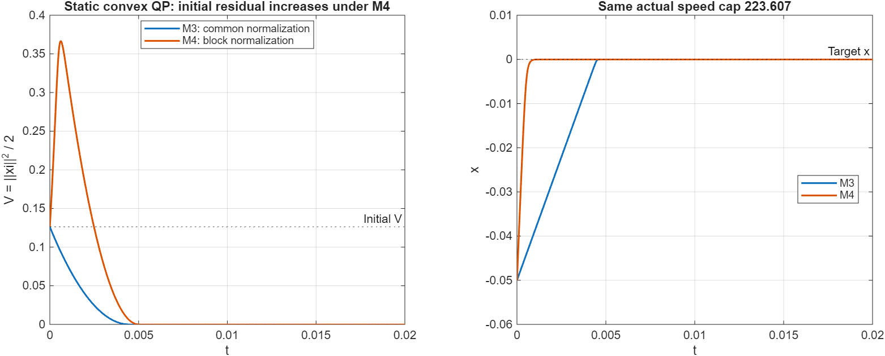

# 分块模型的静态反例

这个小实验直接调用第二版仓库的 `pg_system.m`，没有修改原模型。

问题是最小化 `5*x^2`，约束 `x=0`；`G=10` 正定，`P=1` 满行秩，没有不等式。真实解为 `x=mu1=0`。

参数为 `lambda=1e-6`、`eps=1e-2`。M4 使用 `rates=[100,200,200]`，第三块为空；因此它的实际总速度上限为 `sqrt(100^2+200^2)=223.606797749979`，M3 使用同样的上限。

初值为 `g=[-0.05001005;1.0001015]`，此时阻尼方向恰为 `d=[-0.05;1]`，雅可比为 `J=[10,1;1,0]`。令 `V=norm(xi)^2/2`：

| 数值 | M3 | M4 |
|---|---:|---:|
| 初始 V | 0.126251002551001 | 0.126251002551001 |
| 初始 dV/dt | -56.387684193984 | 385.392229199133 |
| 有限差分复查 dV/dt | -56.3876841937205 | 385.392229198256 |
| 0～0.02 秒最大 V | 0.126251002551001 | 0.366502350998062 |

M4 的残差先变大，之后才变小；两种模型在这个实验里最终都接近解。这证明了分块归一化会破坏 M3 的残差平方下降保证，不能证明 M4 必然发散。

原因是 M3 对整个方向乘同一个正数，而 M4 对各块乘不同的正数，改变了方向。静态问题里令 `s=J'*xi`、`A=J'*J+lambda*I`，则 `d=A\s`，M3 的 `dV/dt=-gamma*s'*d/sqrt(norm(d)^2+eps^2)<=0`。M4 变为 `dV/dt=-s'*D*d`，其中 `D` 是分块正对角矩阵；虽然 `A`、`D` 都正定，也不能保证 `s'*D*d=d'*A*D*d` 非负。

运行 `probe` 可重建 CSV、MAT、FIG 和 PNG；日志保存在 `probe.log`。MATLAB R2025b，ode15s，RelTol=1e-9，AbsTol=1e-11，MaxStep=1e-4。源码同时检查了解析导数与中心差分的一致性。

